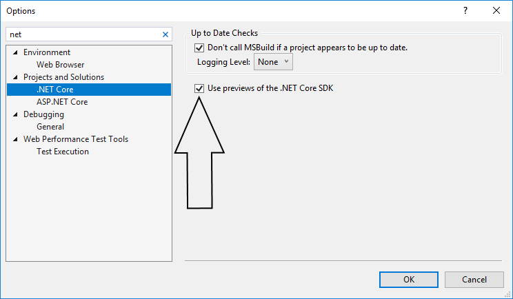
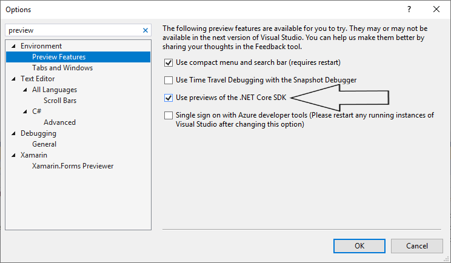
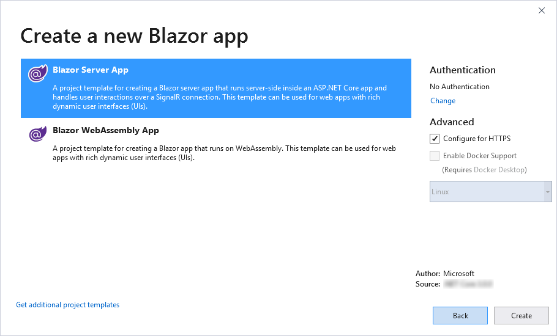

# DevExpress UI for Blazor
This project demonstrates the Preview (CTP) version of [DevExpress UI Components for Blazor](https://www.devexpress.com/blazor/).

The DevExpress UI components featured in this demo are available for free download and can be used in your next Blazor app.* 

> \* Like any software preview, the DevExpress UI for Blazor is not without fault. You should not use these products in production environments or in mission-critical applications.

# Live Demo
 
Check out this [demo in live](https://demos.devexpress.com/blazor/).

# Version compatibility

The following table describes the version compatibility of .NET Core 3.0 Preview and the DevExpress.Blazor NuGet package:

| .NET Core 3.0 version | DevExpress.Blazor.nuget version |
| ------------- | ------------- |
| [.NET Core 3.0 Preview **7**](https://devblogs.microsoft.com/aspnet/asp-net-core-and-blazor-updates-in-net-core-3-0-preview-7/) | **Beta 1** |
| [.NET Core 3.0 Preview **6**](https://devblogs.microsoft.com/aspnet/asp-net-core-and-blazor-updates-in-net-core-3-0-preview-6/) | 0.0.**12** |
| [.NET Core 3.0 Preview **6**](https://devblogs.microsoft.com/aspnet/asp-net-core-and-blazor-updates-in-net-core-3-0-preview-6/) | 0.0.**11** |
| [.NET Core 3.0 Preview **6**](https://devblogs.microsoft.com/aspnet/asp-net-core-and-blazor-updates-in-net-core-3-0-preview-6/) | 0.0.**10** |
| .NET Core 3.0 Preview **5** | 0.0.**9** |
| .NET Core 3.0 Preview **5** | 0.0.**8** |
| .NET Core 3.0 Preview **5** | 0.0.**7** |
| .NET Core 3.0 Preview **5** | 0.0.**6** |
| .NET Core 3.0 Preview **5** | 0.0.**5** |
| .NET Core 3.0 Preview **4** | 0.0.**4** |
| .NET Core 3.0 Preview **3** | 0.0.**3** |

# Set up your environment

1. Install the latest Visual Studio 2019 update.
2. Ensure that you have the latest .NET Core 3 version (from supported versions listed above) installed.
3. If you use the release version of Visual Studio 2019, ensure the "Use previews of the .NET Core SDK" option is enabled.

The corresponding check box's location depends on the Visual Studio build number. You can find the check box here:



or here:



# How to run this demo locally

The Blazor framework uses either WebAssembly-based .NET runtime (**client-side Blazor**) or server-side ASP.NET Core (**server-side Blazor**). Our Blazor components support both of these approaches. 

You can find appropriate demos in the repositories below:

* demo/BlazorDemo.ServerSide
* demo/BlazorDemo.ClientSide
* demo/BlazorDemo.ClientSideWithPrerendering&#42; 

> &#42; For more information, see the [Update Metadata at Runtime - Free SEO Tool](https://community.devexpress.com/blogs/aspnet/archive/2019/06/27/devexpress-blazor-update-metadata-at-runtime-free-seo-tool.aspx) blog post.

To open the required demo, do the following:

1. Download the "**demo**" folder from the proper repository.
2. Use Visual Studio 2019 to open the solution file:
	
	**demo/BlazorDemo.ServerSide/BlazorDemo.ServerSide.sln**
	
	or
	
	**demo/BlazorDemo.ClientSide/BlazorDemo.ClientSide.sln** 
	
	or
	
	**demo/BlazorDemo.ClientSideWithPrerendering/BlazorDemo.ClientSideWithPrerendering.sln** 
	  
3. Start the application.

See also: 

[Official Microsoft Blazor site](https://dotnet.microsoft.com/apps/aspnet/web-apps/client)

# How to create a new project

Follow the steps below to try our UI for Blazor in your own application. 

1. Create a new solution using the "Blazor (server-side)" or "Blazor" template in Visual Studio 2019.

  In the "Create a new project" dialog select "ASP.NET Core Web Application (where the language is C#).
  
  

  In the next step ensure that an "ASP.NET Core 3.\*" framework is selected, and select the "Blazor (server-side)" project template.
  
  

2. Register the DevExpress Early Access feed in Visual Studio's NuGet Package Manager.

  Open the "Package Manager Settings".

  

  Add new NuGet source:
  
  ```https://nuget.devexpress.com/early-access/api```

  

3. Install the "DevExpress.Blazor" NuGet package.

   Navigate to:
   
   
   
   Select the "Early Access" NuGet package source you have just created in the "Package source" combo box.

   Install the "DevExpress.Blazor" NuGet package.
   
   

4. Navigate to the DevExpress Blazor GitHub repository and download all the files from the [client-runtime directory](https://github.com/DevExpress/Blazor/tree/master/client-runtime) to your project’s `wwwroot` directory.

   > To download a file, open it on GitHub, click the **Raw** button, right-click anywhere within the file contents, and select **Save as...** from the displayed context menu.

5. Link the downloaded files:
   * For server-side Blazor, add the lines below to the _\_Host.cshtml_ file.
   * For client-side Blazor, add the lines below to the _Index.cshtml_ file.
    
    ```html
    <head>
      ...
      <link href="dx-blazor.css" rel="stylesheet" />
      <script src="dx-blazor.js"></script>
    </head>
    ```
  
6. Register DevExpress.Blazor namespace in _\_Imports.razor_ file:

   ```html
   @using DevExpress.Blazor
   ```

7. Your application is ready to use DevExpress Blazor.

# Troubleshooting

## 1. DxDataGrid in Blazor

If you use Blazor (client-side) with DxDataGrid, you may see the following exception in a browser:


> "System.InvalidOperationException: No generic method 'Take' on type 'System.Linq.Queryable' is compatible with the supplied type arguments and arguments."

The solution is to follow the [official Blazor documentation](https://docs.microsoft.com/en-us/aspnet/core/host-and-deploy/blazor/configure-linker?view=aspnetcore-3.0).

So, you can either [Disable linking](https://docs.microsoft.com/en-us/aspnet/core/host-and-deploy/blazor/configure-linker?view=aspnetcore-3.0#disable-linking-with-a-msbuild-property) or [Control linking](https://docs.microsoft.com/en-us/aspnet/core/host-and-deploy/blazor/configure-linker?view=aspnetcore-3.0#control-linking-with-a-configuration-file).

In case you decide to control linking: the following types types must be added in the **Linker.xml** file:

```
    <type fullname="System.Linq.Expressions*" />
    <type fullname="System.Linq.Queryable*" />
    <type fullname="System.Linq.Enumerable*" />
    <type fullname="System.Linq.EnumerableRewriter*" />
```    

So, the **Linker.xml** file should look as follows:

```
<?xml version="1.0" encoding="UTF-8" ?>
...
<linker>
  <assembly fullname="mscorlib">
...
    <type fullname="System.Threading.WasmRuntime" />
  </assembly>
  <assembly fullname="System.Core">
...
    <type fullname="System.Linq.Expressions*" />
    <type fullname="System.Linq.Queryable*" />
    <type fullname="System.Linq.Enumerable*" />
    <type fullname="System.Linq.EnumerableRewriter*" />
  </assembly>
...
  <assembly fullname="[PUT YOUR ASSEMBLY NAME HERE]" />
</linker>
```

## 2. The "Early Access" NuGet Feed is empty in Visual Studio

If you don't see packages in the ```https://nuget.devexpress.com/early-access/api``` NuGet feed, make sure that the "Include prerelease" option is selected:


# Included Demo Modules

* Data Grid
  * Column Types
  * Templates
  * Scrolling
  * Virtual Scrolling
  * Cascading Editors
  * Edit Form Template Validation
  * Large Datasets
* Pivot Grid
  * Data Binding Basics
  * Templates
  * Large Datasets
* Scheduler
  * Day View
  * Work Week View
  * Week View
  * Recurring Appointments
* Data Editors
  * ComboBox – Business Object List
  * ComboBox - Virtual Scrolling
  * ComboBox - Allow Input
  * ComboBox - Incremental Filtering
  * ComboBox - NullText
  * ComboBox – Cascading Lists
  * Spin Edit
  * Date Edit  
  * Text Box
* TreeView
* Form Layout
* Form Validation
* Tabs
* Pager

# NuGet Package Change Log

Check out thе NuGet package's [version history](changelog.md).
